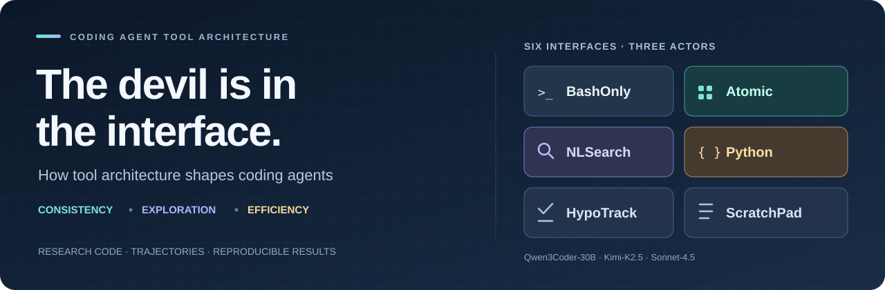

# The Devil Is in the Interface

**Evaluating How Tool Architecture Shapes Coding Agent Behavior**

[](https://tool-arch.purcl.com)
[](https://arxiv.org/abs/2608.11386)

## What we study

How does the interface through which a coding agent uses tools affect its behavior? We compare six tool architectures—BashOnly, Atomic, NLSearch, Python, HypoTrack, and ScratchPad—with similar underlying information and actions. Repeated repository-level issue-fixing experiments across Qwen3Coder-30B, Kimi-K2.5, and Sonnet-4.5 measure consistency, exploration diversity, and efficiency.

## What we found

- **Atomic improves consistency.** Structured file operations are associated with fewer environment-interaction errors and more consistent success across repeated attempts.
- **NLSearch broadens exploration.** A natural-language search interface produces more diverse searches and broader repository coverage.
- **Python improves efficiency.** Executable code combines operations into fewer interaction steps and reduces token use while maintaining broadly comparable task performance.

The [project website](https://tool-arch.purcl.com) illustrates the interfaces and their effects with recorded trajectories. The [paper](https://arxiv.org/abs/2608.11386) presents the full study, including the cognitive-scaffolding variants.

## Reproduce the results

Download the single [data archive](https://drive.google.com/file/d/19CFyQoD_gv_VQbn5zjj9y1hi1_I7dxQb/view?usp=sharing) into the repository root and extract it:

```bash
echo '59b0e867bf36c41f330d5eba23d3b91ac5a4fe867aef695ce2502136add5d4b4  tool-arch-study-data.zip' | sha256sum -c -
unzip tool-arch-study-data.zip
python3.12 -m venv .venv
source .venv/bin/activate
python -m pip install -r scripts/requirements.txt
python scripts/reproduce_from_processed.py
```

The archive contains `data/raw_traj/` and `data/processed/`. Reproduction scripts read the processed intermediates and write tables, metric summaries, and figure PDFs to `results/`.

See [Reproduce the paper results](reproduce-paper-results.md) for commands grouped by finding and brief metric definitions.

## Repository layout

```text
.
├── README.md
├── reproduce-paper-results.md   # Table and figure reproduction
├── tool-interfaces.md           # Interface designs and code map
├── scripts/                     # Reproduction scripts
├── data/                        # Extracted from the data archive
│   ├── raw_traj/                # Agent trajectories grouped by experiment
│   └── processed/               # Inputs used by reproduction scripts
├── agent_src/                   # Agent implementations for reference
│   ├── evaluation-setup.md      # Benchmark harness setup and launch commands
│   ├── trae-agent/              # BashOnly, Atomic, NLSearch, HypoTrack, ScratchPad
│   └── simple-agent/            # Python interface
└── assets/                      # README artwork
```

## Agent source

We include the agent implementations for reference and further experimentation. They derive from [Trae Agent](https://github.com/bytedance/trae-agent): the Trae-based variants expose shell, structured file operations, natural-language search, and cognitive scaffolding; the adapted Python agent exposes executable code.

- [Tool-interface implementation guide](tool-interfaces.md): how each setup works and where it is implemented.
- [Evaluation setup](agent_src/evaluation-setup.md): Docker, Python environments, benchmark harnesses, and experiment launchers.

The source retains its upstream attribution and license notices. See the licenses for [Trae-based agents](agent_src/trae-agent/LICENSE) and the [Python agent](agent_src/simple-agent/LICENSE).
